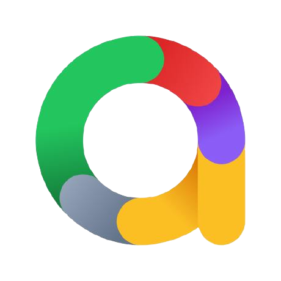
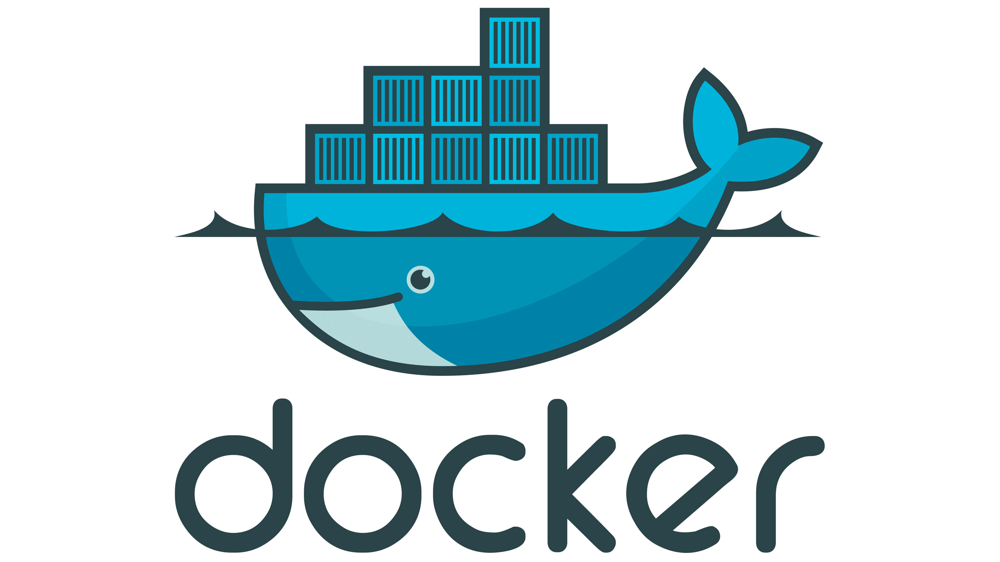
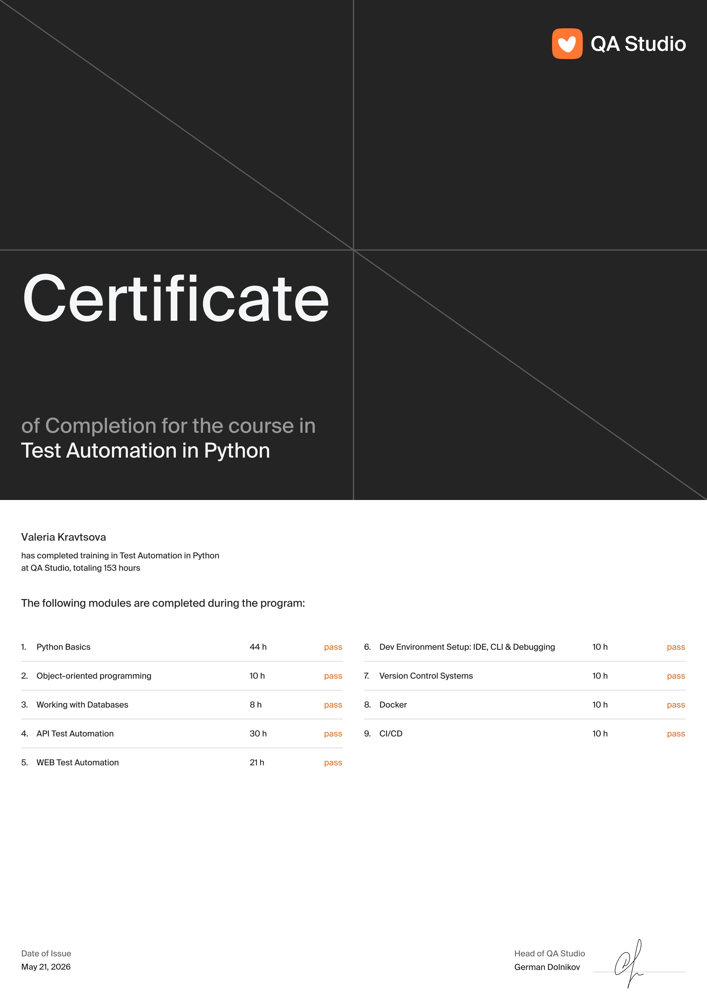
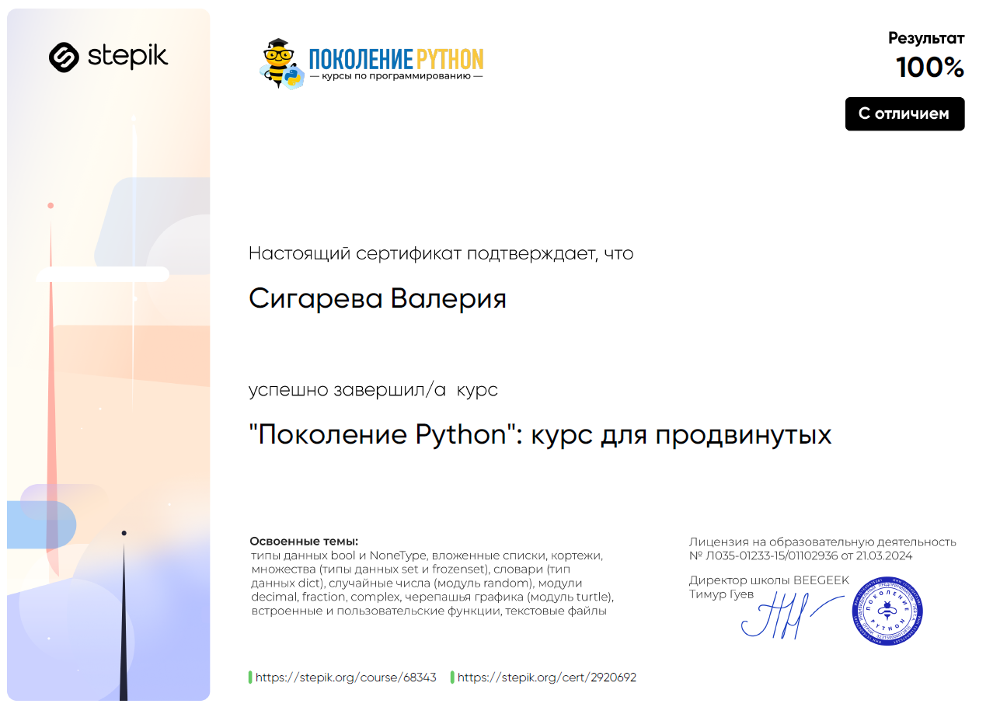

## Всем привет 👋
##### Меня зовут Валерия, я AQA-инженер 🧡

* 🐍 Пишу автотесты на Python
* ⚙️ Развиваюсь в автоматизации
* 📑 Опыт и навыки в **[резюме](@)**
* 🤝 Мои контакты:

  

## 🎒 Мой стек

### Python QA Auto:
| Python | PyCharm | Git | Pytest | Requests | Selenium | Allure Report | Docker | Gitlab CI |
|--------|---------|-----|--------|----------|----------|---------------|--------|-----------|
|   |   || |  | | | | |

 

## Тестирование API и интеграций

  &nbsp
  &nbsp
  &nbsp
  &nbsp
  &nbsp

## Тестирование Web и Мобильных приложений

  &nbsp
  &nbsp
  &nbsp
  &nbsp
  &nbsp

## Логи и мониторинги

  &nbsp
  &nbsp
  &nbsp
  &nbsp
  &nbsp

## Тестовая документация 
  

    &nbsp
    &nbsp
  

## Работа с базами данных

  &nbsp
  &nbsp

 

## ✨Мои проекты:
| API My Shows Rating |  API Битва покемонов | UI Битва покемонов |
|---------------------|----------------------|--------------------|
|[my-shows-api-tests](Ссылка)|[pokemonbattle-api-tests](Ссылка)   | [pokemonbattle-e2e-tests](Ссылка)   
| Pytest, Requests, Docker|Pytest, Requests, Gitlab CI| Selenium, Gitlab CI|

 

## 📚 Обучение
||
||

<!--
**Kravtsova-Valeria/Kravtsova-Valeria** is a ✨ _special_ ✨ repository because its `README.md` (this file) appears on your GitHub profile.

Here are some ideas to get you started:

- 🔭 I’m currently working on ...
- 🌱 I’m currently learning ...
- 👯 I’m looking to collaborate on ...
- 🤔 I’m looking for help with ...
- 💬 Ask me about ...
- 📫 How to reach me: ...
- 😄 Pronouns: ...
- ⚡ Fun fact: ...
-->
